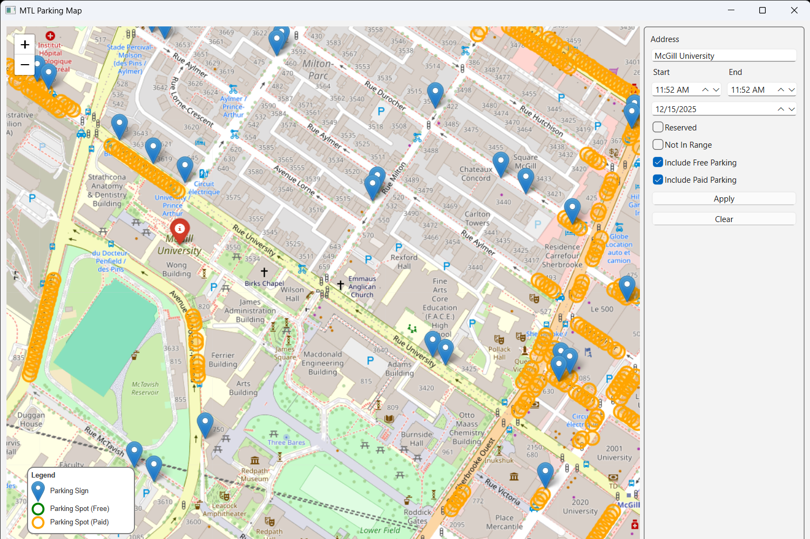

# Montreal Parking Visualization App

This project is a desktop application that displays the location of on-street parking signs and paid parking spots 
in Montreal.

The application allows users to visualize parking regulations interactively and filters parking signs by:
- Datetime interval
- Geographical bounding box

The user interface is shown below.

## Data Sources
The parking sign data is obtained from the *Montreal city open data* webpage 
(https://donnees.montreal.ca/dataset/stationnement-sur-rue-signalisation-courant).
Each parking sign description is parsed to extract:
- Time intervals
- Weekday intervals
- Month intervals
This enables time-based filtering of packing signs and spots.

The paid parking spot data is obtained from *Agence de mobilité durable open data* webpage 
(https://www.agencemobilitedurable.ca/en/information/open-data/description-of-available-data).

## Technologies
The technologies used are:
- PySide6: Desktop GUI framework
- Folium (Leaflet.js): Interactive web map and marker overlays
- GeoPandas: Geospatial data processing and analysis
- DuckDB: Analytical database for efficient data querying

## Platform Support
Tested on Windows only.

## Project Status
This project is a prototype and serves as a proof-of-concept for a cross-platform mobile version
that is currently under development.

